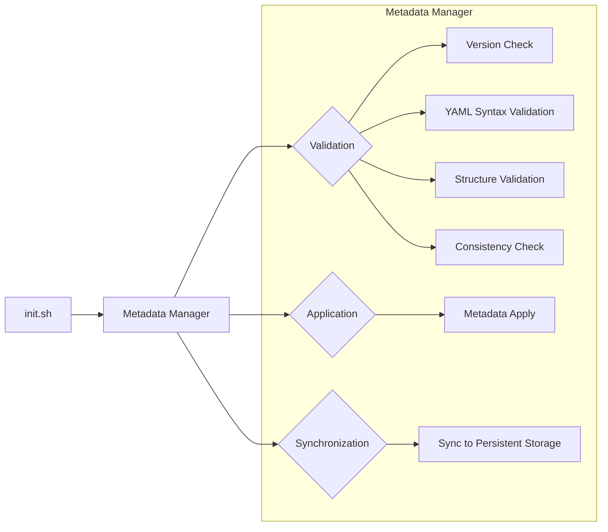

# DE_01Metadata_Hasura
Lightweight scripts track, diffs and apply Hasura metadata.
Adopt and adapt as needed!

## Works out-of-the-box with: 
HASURA_VERSION=v2.48.0 | CLI_VERSION=v2.48.0

## The Non-Negotiables 
1. Image–CLI lock-step: `graphql-engine:v2.48.0` must pair with `cli-hasura-linux-amd64:v2.48.0` (V3 metadata). 
2. CLI owns the folder: it bootstraps its own metadata tree—don’t pre-create or mount anything.

## How It Works?
### Keeps all simple but clear
1. Service Initialization (`init.sh`) :Manages core components up & health
- Dependency & version check
- Self-healing (checksums itself + metadata-manager.sh) 
- Starts Hasura engine - Waits for `/healthz` endpoint

2. Metadata Lifecycle (`metadata-manager.sh`):Handles different scenarios metadata operations
- New project (empty metadata) 
    -Exports canonical template 
    -Applies to Hasura 
    -Logs: "Template seeded: v3"
- Existing project (user metadata)
    -Diffs against current state
    -Validates schema
    -Applies if changed
    -Cleans temp directories
 
### Overview

## Results

>Requires some setup — not one-click.
>
>But once you manage metadata systematically, optimization becomes continuous.

Theory is gray. Implementation turns it green.

> If this sparked an idea or saved your time a little, give it a ⭐ — Let this helps more!

---
## Interested in more details? 
check [Dev.to: Details of Arch/Design](https://dev.to/michalelee0609)
P.S. Dev.to → comes in 24h-48h behind github to prepare details for reference.
## Beyond Hasura? Got data pipeline headaches?  
check [Fiverr: Ready-to-deploy tools](https://www.fiverr.com/michalelee)

